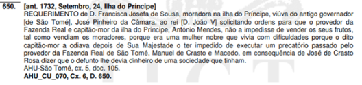
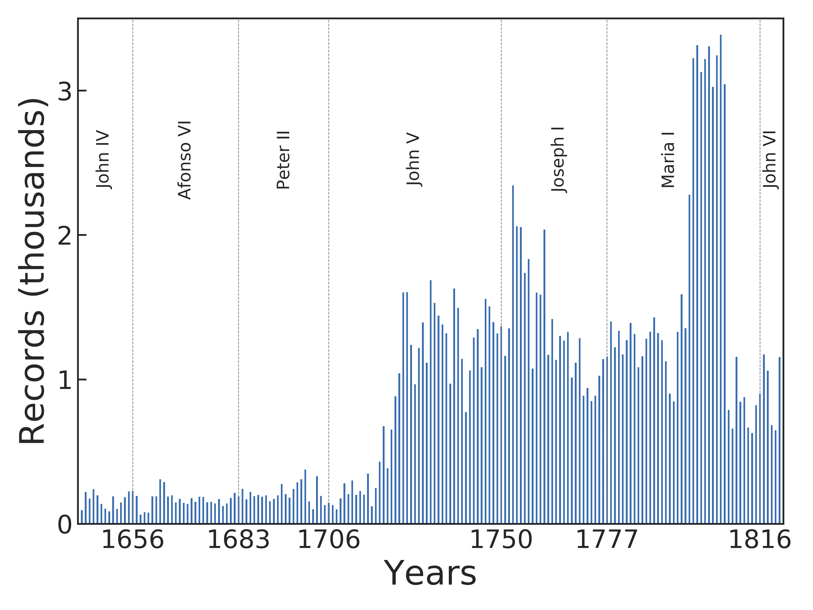
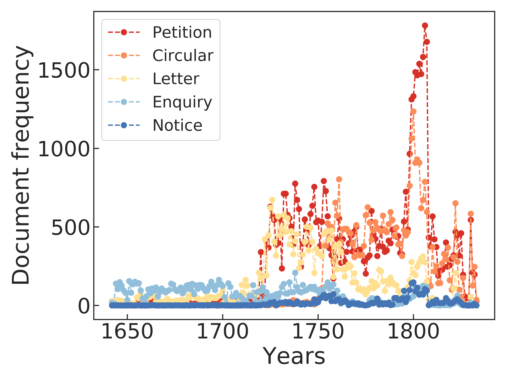
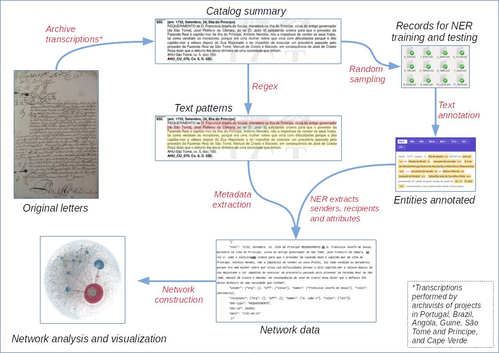
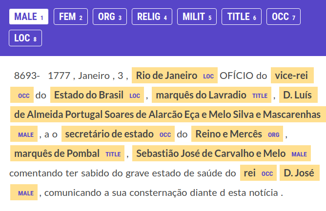
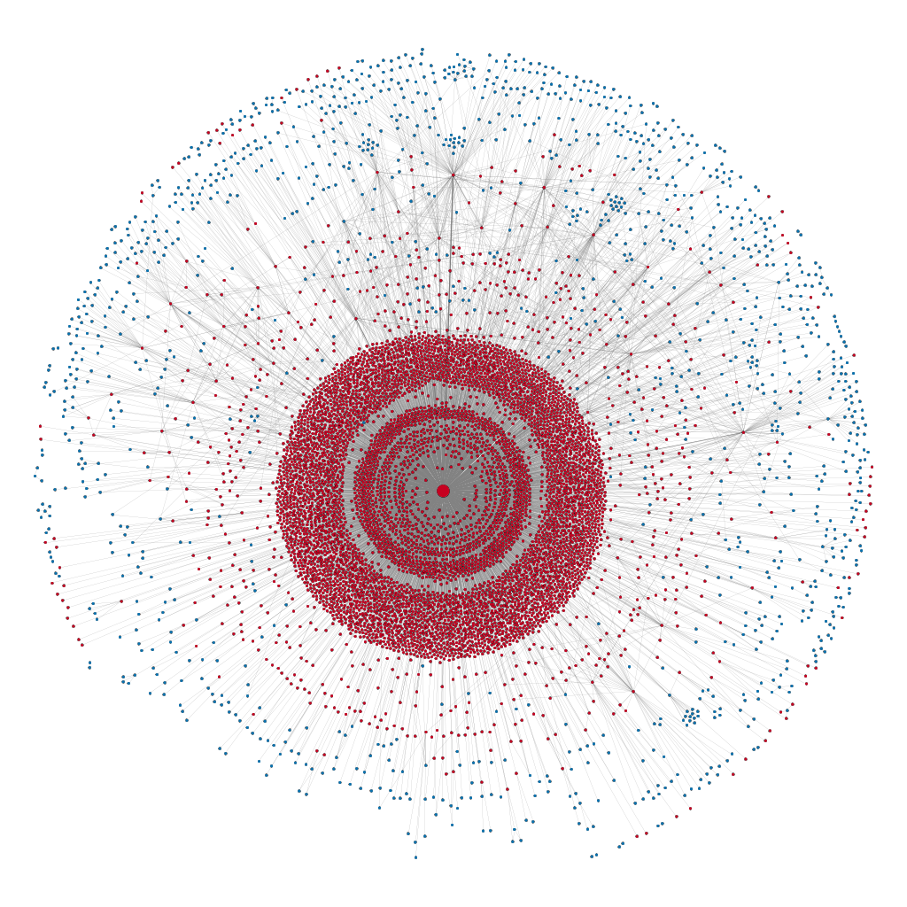
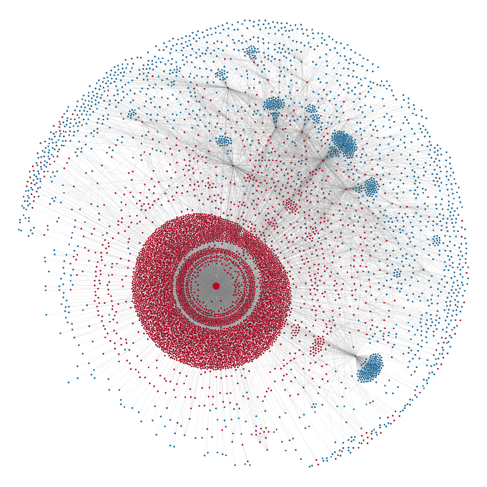
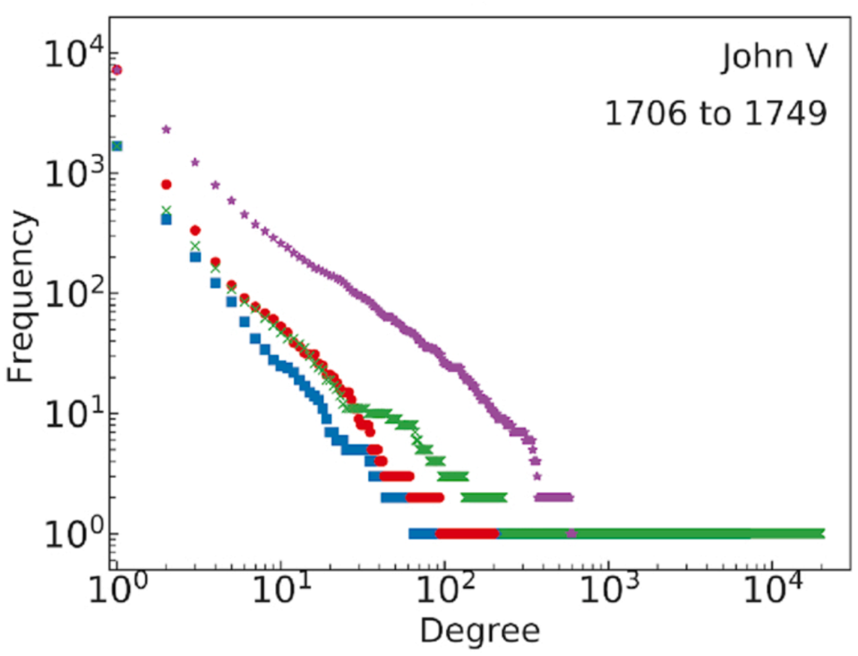
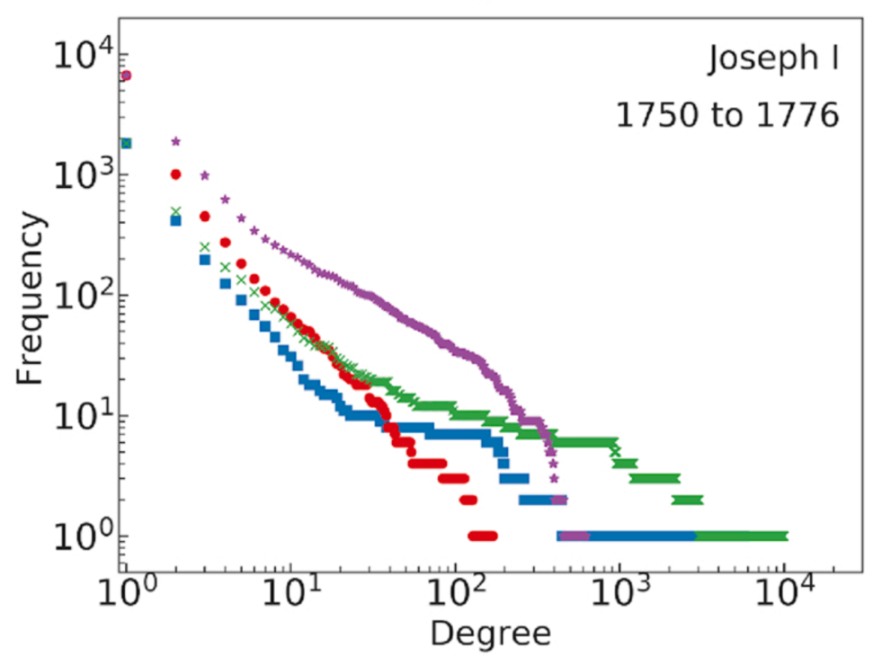
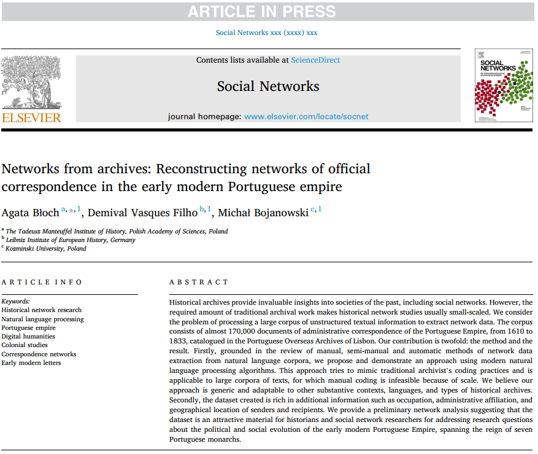

<!--
vim:spell:spelllang=en_us 
-->

```{r, setup, include=FALSE, cache=FALSE}
suppressPackageStartupMessages({
  library("knitr")
  library(RefManageR)
  requireNamespace("xaringanExtra")
})

xaringanExtra::use_tile_view()

knitr::opts_chunk$set( 
  echo=FALSE,
  cache = FALSE,
  dev = "svg"
)

BibOptions(
  check.entries = FALSE,
  bib.style = "authoryear",
  cite.style = "authoryear",
  style = "markdown",
  hyperlink = FALSE,
  dashed = FALSE
)
bib <- ReadBib(here::here("nfa.bib"), check = FALSE)
```


class: center top main-title section-title-4

# Networks from archives  
.normal[Reconstructing networks of official correspondence in the early modern Portuguese empire]

.class-info[
Agata Błoch .small[Tadeusz Manteuffel Institute of History, Polish Academy of Sciences]  
Demival Vasques Filho .small[Leibniz Institute of European History]  
<span style="text-decoration: underline;">Michał Bojanowski</span> .small[Kozminski University]


]

---


# Portuguese empire


.tiny[Source: Wikipedia]

Actual territories (modern borders) that were once part of Portuguese Empire (PE).

---


# Historiographical debate

Two theories/approaches:

- **Metropole-periphery dependence** `r Citep(bib, c("prado_colonial_1967", "novais_portugal_1995"))`
    - PE as a system of political and economic dependencies between the Crown and the colonies
    - Marxian perspective

- **Multi-continental monarchy** `r Citep(bib, c("fragoso_monarquia_2009", "fragoso_um_2017"))`
    - PE as a complex interplay of political, economic, administrative, and social **networks**.
    - Local elites vis a vis the Crown


???

- Negotation/cooperation vs competition between local elites and the crown

---


# Questions

- Who are the key actors?
- What are the relevant types of relationships?
- How these networks look like?
- How these networks change over the years?

Do the network changes reflect or predate important social/political/economical events or processes?

E.g.:

- Colonies becoming more and more independent politically/economically from the Crown

---


# Intermediate goals

.large[
Reconstruct networks of administrative correspondence using data on **170'000** documents exchanged in the period **1610-1833** deposited at Historical Overseas Archives of Lisbon.
]

Today:

- Report how we used modern tools of Natural Language Processing to extract structured data from otherwise unstructured free text
- Present preliminary descriptive analysis of the created data

---


# The originals

.small[Petition of Francisca Josefa de Sousa to King John V (1732)] .tiny[Source: Sao Tome and Principe Islands, AHU CU_070, cx 6., doc. 650.]


???

- Stored in books

---


# The catalogue



???

- Prepared by archivist cataloging the documents
- In Portuguese
- Contain among other things:
    - Date
    - Sender's location
    - Sender's Colony

---


# Number and types of documents

Types of documents:
*Requerimento* (Petition),
*Ofício* (Circular),
*Carta* (Letter),
*Consulta* (Enquiry),
*Aviso* (Notice)

.pull-left[

]

.pull-right[

]

---


# The pipeline



???

- Using Spacy. Using regex for other metadata.


---


# Data processing

**NER model training**

- Random sample of **4230** (2.5%) documents
    - Annotate entities (8 categories) manually
- Train the model on 80% of documents, test on 20%
    - Accuracy: **93.1%**
- Apply the trained NER model to the remainder

**Identifying senders and recipients**

- Using Regular Expressions
  
As a result:

- ~**9000 recipients**
- ~**44000 senders**
- ~**1500** actors who are **both senders and recipients**

???

What was the accuracy of the

- Original Spacy model: advertised 89% on modern Portuguese, 80% on our corpus
- Original model trained with our data:
- Model trained from scratch

---


# Preparing training data



.small[
Using Prodigy (https://prodi.gy/)
]

???

Annotating:

- Persons
    - Men and women separately
- Organization names (institutions and such)
- Location names (cities, military forts)
- Titles
- Occupations

---


# JSON with free text and metadata

.small[
```
{
  "text": "1732, Setembro, 24, Ilha do Príncipe REQUERIMENTO de D. Francisca
    Josefa de Sousa, moradora na ilha do Príncipe, viúva do antigo governador de
    São Tomé, José Pinheiro da Câmara, ao rei D. João V solicitando ordens para
    que o provedor da Fazenda Real e capitão-mor da ilha do Príncipe, António
    Mendes, não a impedisse de vender os seus frutos, tal como vendiam os
    moradores, porque era uma mulher nobre que vivia com dificuldades porque o
    dito capitão-mor a odiava depois de Sua Majestade o ter impedido de executar
    um precatório passado pelo provedor da Fazenda Real de São Tomé, Manuel de
    Crasto e Macedo, em consequência de José de Crasto Rosa dizer que o defunto
    lhe devia dinheiro de uma sociedade que tinham",
  "sender": {"aff": [], "title": [], "names": ["D. Francisca Josefa de Sousa"], "occ": []},
  "recipient": {"aff": [], "title": [], "names": ["D. João V"], "occ": ["rei"]},
  "doc-type": "REQUERIMENTO",
  "doc-id": 293952,
  "date": "1732-09-24"
}
```
]

---


# Networks

.pull-left[

.small[John V (1706- 1750)]
]

.pull-right[

.small[Joseph I (1750- 1777)]
]


???

- Note the emergence of "hubs" corresponding to other PE officials
    - secreatary of the Overseas Council
    - secretary of state
    - governors
    - judges


---


# Degree distributions

.pull-left[

]

.pull-right[

]

???

Complementary cumulative frequency for degrees and weighted degrees of the correspondence networks during the reign of seven Portuguese monarchs

The degree distributions corroborate the idea that 

- citizens from the colonies could reach the monarch directly, given the extremely heavy-tailed indegree distributions. 

It is interesting to note a change in these in-degree distributions from John V to Joseph I.

- During the reign of Joseph I, more governmental officials (especially secretaries and governors)
appear as important recipients of the administrative correspondence exchange between the
colonies and the metropole.

---


# More descriptives

| Monarch | Size | Size of LCC | Average degree | Density |
|:---:|:---:|:---:|:---:|:---:|
| John IV (1640- 1656)   | 301    | 265 (88%)    | 2.06 | 0.0068 | 
| Afonso VI (1656- 1683) | 593    | 552 (93%)    | 2.26 | 0.0034 | 
| Peter II (1683- 1706)  | 611    | 542 (89%)    | 2.14 | 0.0035 | 
| John V (1706- 1750)    | 8279   | 8150 (98%)   | 2.36 | 0.0003 | 
| Joseph I (1750- 1777)  | 7869   | 7734 (98%)   | 2.57 | 0.0003 | 
| Maria I (1777- 1816)   | 18,506 | 18,341 (99%) | 2.55 | 0.0001 | 
| John VI (1816- 1826)   | 2781   | 2728 (98%)   | 2.31 | 0.0008 | 

???

LCC, average degree and density are calculated considering both in- and out-edges. 

- The average degree remains remarkably stable
- The size of the LCC shows that the networks were very well connected albeit sparse.

---


# Outlook

Data-wise:

1. Data cleaning
    - Deduplication
    - Dictionaries of persons, organizations and locations
2. Data enrichment
    - Birth/death dates
    - Missing
3. Publish
    - Data will be publicly released
    - Monitor https://mape.netlify.app

---


# References

.small[
```{r references, echo=FALSE, results="asis"}
PrintBibliography(bib)
```
]

---

# Thank you!

.pull-left[
**Read the paper**

.small[Błoch, A., Vasques Filho, D., & Bojanowski, M. (2020). Networks from archives: Reconstructing networks of official correspondence in the early modern Portuguese empire. *Social Networks* in press.]


]

.pull-right[
**Get in touch!**

Find out more about the **Mapping the Atlantic Portuguese Empire** project at https://mape.netlify.app


.small[
Thank you NCN for support through grant  
`2017/27/N/HS3/01104`.
]

.small[
These slides are available at  
[poi-hnr.github.io/talk-networks_from_archives](https://poi-hnr.github.io/talk-networks_from_archives)
]
]


