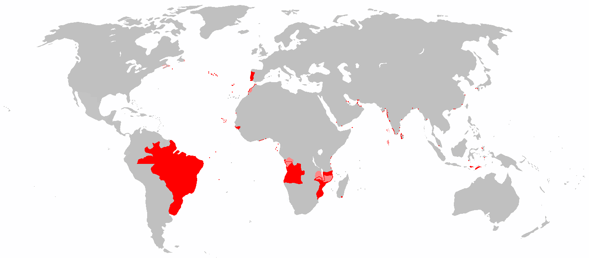

<!--
vim:spell:spelllang=en_us 
-->

```{r, setup, include=FALSE, cache=FALSE}
suppressPackageStartupMessages({
  library("knitr")
  library(RefManageR)
  requireNamespace("xaringanExtra")
})

xaringanExtra::use_tile_view()

knitr::opts_chunk$set( 
  echo=FALSE,
  cache = FALSE,
  dev = "svg"
)

BibOptions(
  check.entries = FALSE,
  bib.style = "authoryear",
  cite.style = "authoryear",
  style = "markdown",
  hyperlink = FALSE,
  dashed = FALSE
)
bib <- ReadBib(here::here("nfa.bib"), check = FALSE)
```


class: center top main-title section-title-4

# Networks from archives  
.normal[Reconstructing networks of official correspondence in the early modern Portuguese empire]

.class-info[
Agata Błoch .small[Tadeusz Manteuffel Institute of History, Polish Academy of Sciences]  
Demival Vasques Filho .small[Leibniz Institute of European History]  
<span style="text-decoration: underline;">Michał Bojanowski</span> .small[Kozminski University]


]

---


# Portuguese empire



.tiny[Source: Wikipedia]

Territories that were once part of Portuguese Empire.

---


# Historiographical debate

Two theories/approaches:

- **Metropole-periphery dependence** `r Citep(bib, c("prado_colonial_1967", "novais_portugal_1995"))`
    - PE as a hierarchical system of political and economic dependencies between the Crown and the colonies

- **Multi-continental monarchy** `r Citep(bib, c("fragoso_monarquia_2009", "fragoso_um_2017"))`
    - PE as a complex interplay of political, economic, administrative, and social **networks**.
    - Local elites vis a vis the Crown

Questions:

- Who are the key actors?
- What are the relevant types of relationships?
- How these networks look like?
- How these networks over the years?


???

- Negotation/cooperation vs competition between local elites and the crown

---


# Overarching research problem

> The structure of the political/economic/administrative/social networks...
> 
> - reflect
> - predate
> 
> important events and macro-level processes such as
> 
> - colonies becoming more and more independent politically/economically from the Crown

To this end

- Reconstruct networks of administrative correspondence using data on 170'000 documents exchanged in the period 1610 - 1833 deposited at Historical Overseas Archives of Lisbon


---


# Goals

- Report how we used modern tools of Natural Language Processing to extract structured data from otherwise unstructured free text
- Present preliminary descriptive analysis of the created data

---


# The originals

.small[Petition of Francisca Josefa de Sousa to King John V (1732)] .tiny[Source: Sao Tome and Principe Islands, AHU CU_070, cx 6., doc. 650.]


---


# The catalogue


???

Screenshot from a PDF

---


# Types of documents and such

> Figures showing types of documents and frequencies

---


# The pipeline


---


# NER model training


???

Using Spacy. Using regex for other metadata.

---

# JSON

> Show the JSON

---


# Network figures

> John V, Joseph I, and perhaps other from Drive

---


# Degree distributions

---


# LCCs

---


# Outlook

1. Data cleaning
2. Data enrichment
3. Publish

---


# References

.tiny[
```{r references, echo=FALSE, results="asis"}
PrintBibliography(bib)
```
]

---

# Thank you!

.pull-left[
**Read the paper**

.small[Błoch, A., Vasques Filho, D., & Bojanowski, M. (2020). Networks from archives: Reconstructing networks of official correspondence in the early modern Portuguese empire. *Social Networks* in press.]


]

.pull-right[
**Get in touch!**

Find out more about the **Mapping the Atlantic Portuguese Empire** project at https://mape.netlify.app


.small[
Thank you NCN for support through grant  
`2017/27/N/HS3/01104`.
]

.small[
These slides are available at  
[poi-hnr.github.io/talk-networks_from_archives](https://poi-hnr.github.io/talk-networks_from_archives)
]
]


